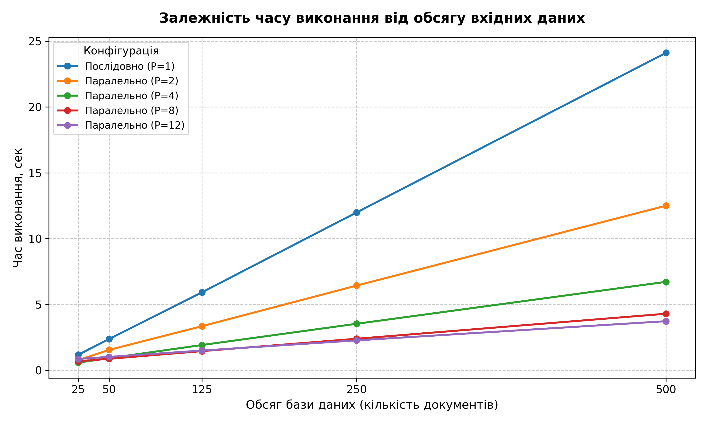
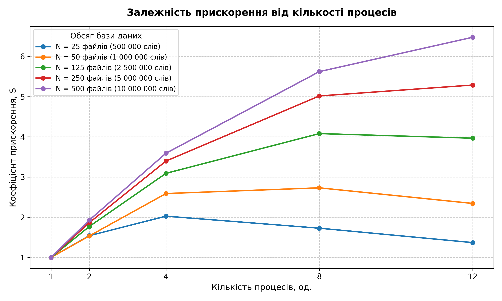
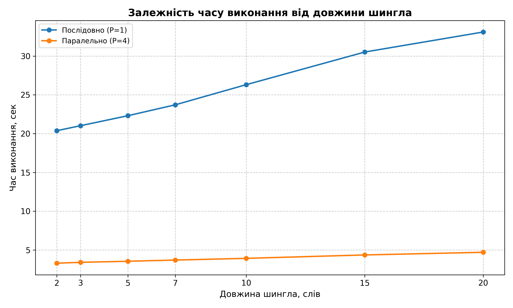

# Паралельний алгоритм перевірки тексту на плагіат (Алгоритм шинглів)

## 📌 Огляд проєкту
Цей проєкт реалізує високоефективну систему виявлення текстових запозичень, засновану на **алгоритмі шинглів (W-shingling)** та **коефіцієнті схожості Жаккара**. Основна увага приділена дослідженню та оптимізації паралельних обчислень на багатоядерних процесорах за допомогою стандартного модуля Python `multiprocessing`.

## 🚀 Основні технічні рішення та архітектура
- **Оптимізована паралельна обробка:** Використання моделі Master-Worker (`multiprocessing.Pool`) для обходу обмежень Global Interpreter Lock (GIL).
- **Декомпозиція за документами (1-to-N):** Відмова від розрізання одного тексту на користь розподілу цілих документів з бази даних між воркерами. Це повністю усуває проблему «крайових ефектів» (втрати шинглів на межах блоків).
- **Оптимізована ініціалізація воркерів:** Використання механізму `initializer` для одноразової передачі цільового документа у глобальний простір пам’яті процесів. Це дозволило суттєво зменшити накладні витрати на міжпроцесну серіалізацію даних.
- **Швидке хешування:** Використання алгоритму **MD5** із конвертацією у 64-бітне значення для зменшення споживання пам’яті та прискорення операцій порівняння.

## 📊 Результати експериментів (на базі Intel Core i5-14600KF)
У ході експериментального тестування на базі з 500 документів (10 000 000 слів) було отримано наступні результати:
- **Максимальне прискорення (S):** **6.47x** при використанні 12 паралельних процесів (базова конфігурація k=7). На ресурсомістких задачах (при k=20) алгоритм масштабується до **7.03x**.
- **Час обробки:** Знижено з 24.11 сек (послідовно) до **3.72 сек** (паралельно на 12 ядрах).
- **Ефективність (E):** Найкращий баланс використання ресурсів спостерігається на 4 процесах (ефективність 90%, E=0.90).
- **Вплив параметра k:** Доведено, що збільшення довжини шингла очікувано знижує відсоток схожості (відсіюючи "шум"), при цьому паралельна архітектура ефективно компенсує зростання обчислювального навантаження.

## 📁 Структура проєкту
- `core/` — основна логіка: `analyzer.py` (послідовний алгоритм) та `parallel_engine.py` (багатопроцесорний рушій).
- `benchmarks/` — скрипти для проведення замірів швидкодії (`parallel_speed_test.py`, `k_test.py`).
- `tests/` — модульні тести, стрес-тести (до 1 млн слів) та верифікація на реальних файлах.
- `data/` — генератори вхідних даних та збережені результати замірів у форматі `.csv`.
- `graphs/` — Python-скрипти (matplotlib/pandas) для візуалізації результатів.

## 🛠 Як запустити
1. **Клонуйте репозиторій:**
   ```bash
   git clone https://github.com/SofiiaSobtsova/plagiarism-checker-parallel.git
   ```
2. **Встановіть залежності (для графіків):**
   ```bash
   pip install -r requirements.txt
   ```
3. **Запустіть інтерактивне меню:**
   ```bash
   python main.py
   ```

## 📈 Результати та візуалізація

У ході дослідження було побудовано графіки, які наочно демонструють переваги багатопроцесорної обробки. Всі графіки автоматично генеруються на основі зібраних csv файлів.

### 1. Залежність часу обробки від обсягу даних
Паралельна реалізація демонструє суттєву перевагу при обробці великих масивів даних. При малих обсягах (до 50 файлів) прискорення менш помітне через накладні витрати на запуск процесів.



### 2. Ефективність паралелізації (Speedup)
Графік прискорення демонструє наближено лінійне зростання з подальшим насиченням при збільшенні кількості процесів. Найвищий показник досягнуто на 12 процесах при обробці бази з 500 файлів.



### 3. Вплив довжини шингла (k) на продуктивність
Збільшення k значно навантажує послідовний алгоритм через роботу з довшими рядками, а час паралельного виконання зростає незначно порівняно з послідовною реалізацією.



## ⚙️ Використані технології
- Python 3.12
- multiprocessing (Process Pool, map, initializer)
- hashlib (MD5)
- matplotlib, pandas (Data Visualization)

## ✅ Основні можливості
- Послідовне та паралельне порівняння текстів
- Верифікація коректності результатів
- Стрес-тестування на великих обсягах даних
- Автоматичне обчислення прискорення та ефективності
- Генерація CSV-результатів та графіків

## 👩‍🎓 Автор
Собцова Софія Олександрівна  
Група ІП-34  
НТУУ «КПІ ім. Ігоря Сікорського»  
2026
