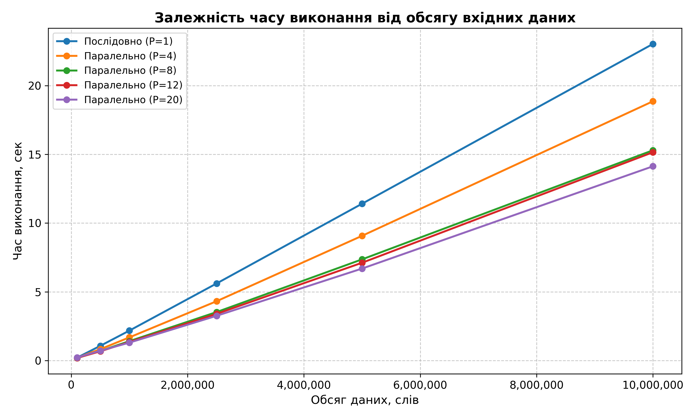
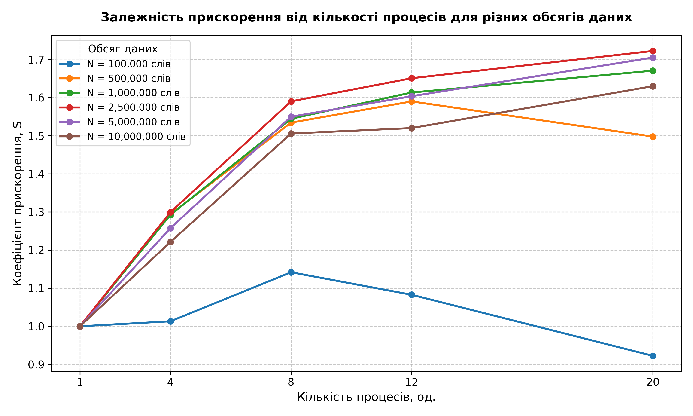
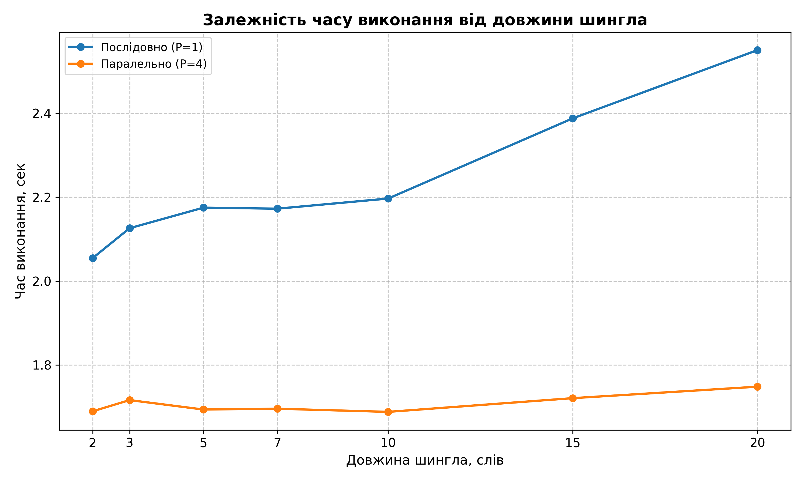

# Паралельний алгоритм перевірки тексту на плагіат (Алгоритм шинглів)

## 📌 Огляд проєкту
Цей проєкт реалізує систему виявлення текстових запозичень, засновану на **алгоритмі шинглів (W-shingling)** та **коефіцієнті схожості Жаккара**. Основна увага приділена дослідженню ефективності паралелізації обчислень на багатоядерних процесорах за допомогою модуля Python `multiprocessing`.

## 🚀 Основні технічні рішення
- **Паралельна обробка:** Використання моделі Master-Worker для обходу обмежень GIL.
- **SHA-256 Хешування:** Забезпечення унікальності та швидкості порівняння цифрових відбитків тексту.
- **Декомпозиція з перекриттям:** Реалізовано інтелектуальний розподіл токенів між процесами з врахуванням довжини шингла (k-1), що забезпечує еквівалентність результатів із послідовною реалізацією.
- **Масштабованість:** Досліджено роботу системи на масивах даних обсягом до 10 000 000 слів.

## 📊 Результати експериментів
В ході тестування багатопроцесної архітектури було отримано наступні результати:
- **Максимальне прискорення (S):** 1.67x при використанні 8 логічних процесів.
- **Ефективність (E):** Найкращі показники ефективності спостерігаються на великих обсягах даних (від 1 млн слів), де витрати на створення процесів нівелюються швидкістю обробки.
- **Вплив k:** Доведено, що збільшення довжини шингла підвищує стійкість до випадкових збігів, але дещо знижує показник схожості при незначних модифікаціях.

## 📁 Структура проєкту
- `core/` — основна логіка: `analyzer.py` (послідовний) та `parallel_engine.py` (паралельний).
- `benchmarks/` — скрипти для проведення замірів швидкодії та вивчення впливу параметрів.
- `tests/` — модульні тести, стрес-тести та верифікація на реальних файлах.
- `data/` — вхідні дані та збережені результати у форматі CSV.
- `graphs/` — скрипти для візуалізації результатів у вигляді графіків та самі графіки.

## 🛠 Як запустити
1. **Клонуйте репозиторій:**
   ```bash
   git clone https://github.com/SofiiaSobtsova/plagiarism-checker-parallel.git
   ```
2. **Встановіть залежності (для графіків):**
   ```bash
   pip install -r requirements.txt
   ```
3. **Запустіть інтерактивне меню:**
   ```bash
   python main.py
   ```

## 📈 Результати та візуалізація

У ході дослідження було проведено серію тестів на текстах обсягом від 100 тис. до 10 млн слів.

### 1. Залежність часу обробки від обсягу даних
Паралельна реалізація демонструє стабільну перевагу на великих масивах даних. 



*Пояснення:* При малих обсягах даних (до 500 тис. слів) різниця між послідовним та паралельним методами незначна через накладні витрати на створення процесів. Проте на 10 млн слів паралелізація дозволяє значно зменшити час обробки.

### 2. Ефективність паралелізації (Speedup)
Було досліджено, як кількість ядер впливає на прискорення обчислень.



*Пояснення:* Найкраще прискорення досягається при використанні 8–12 процесів. Подальше збільшення кількості процесів (до 20+) знижує ефективність через накладні витрати (overhead) міжпроцесної взаємодії та синхронізації.

### 3. Вплив довжини шингла (k) на продуктивність
Параметр k впливає не лише на точність, а й на час формування хеш-таблиці.



*Пояснення:* Спостерігається загальна тенденція до зростання часу обробки зі збільшенням k, з незначними відхиленнями, оскільки алгоритму потрібно обробляти довші послідовності токенів для кожного шингла.

## ⚙️ Використані технології
- Python 3.12
- multiprocessing
- hashlib (SHA-256)
- matplotlib
- pandas

## ✅ Основні можливості
- Послідовне та паралельне порівняння текстів
- Верифікація коректності результатів
- Стрес-тестування на великих обсягах даних
- Автоматичне обчислення прискорення та ефективності
- Генерація CSV-результатів та графіків

## 👩‍🎓 Автор
Собцова Софія Олександрівна  
Група ІП-34  
НТУУ «КПІ ім. Ігоря Сікорського»  
2026
